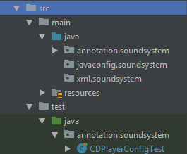

# Spring-in-Action

This project is a source code that references from “Spring in Action 4th edition”.

Although most of the source code implementations are available in this book, there are a few details that do not fit in.

At the same time, our local environment is different, which may lead to some detailed configuration differences. Above factors prompted me to rewrite a complete source code.

## IDE

 Intellij IDEA

## Server

Tomcat

## What you can learn from this book?

1.  Learn how to use spring to simplify development.
1.  Learn how to use [Mockito](https://github.com/mockito/mockito) and [Junit](https://junit.org/junit4/) to test Srping.

### Inconsistent Statement

-   In Charpter 2, it will introduce three ways to wire the spring bean. So I will use 3 different packages to introduce them, such as `annotation.*`, `xml.*` and `javaconfig.*`.
    
    